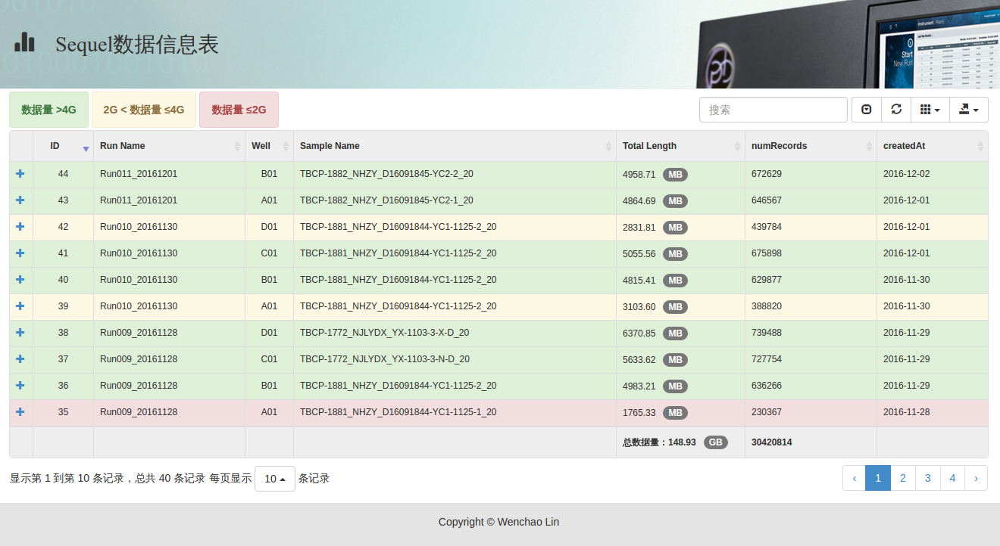

# sequelOverview
Use Pacific Biosciences Sequel SMRT Link Web Services API to show Statics Information of all runs remote.

## Settings

change following in `index.html` according to your own Sequel SMRT Link host.

```javascript
var SmrtLinkapiServer = 'http://<host>:<port>';
```
## Example Settings

```javascript
var SmrtLinkapiServer = 'http://192.168.21.11:9091';
```


## screenshot




[WenchaoLin](http://github.com/WenchaoLin)
